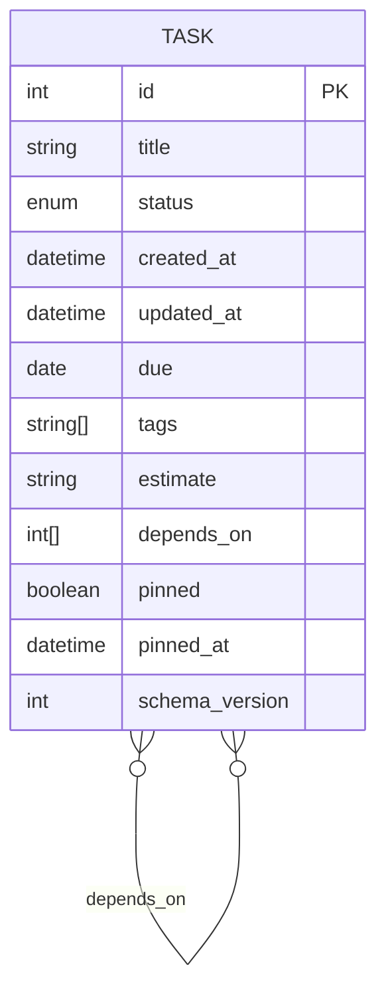
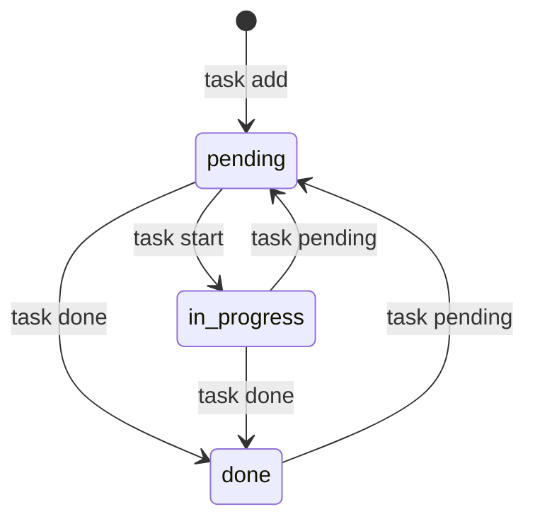
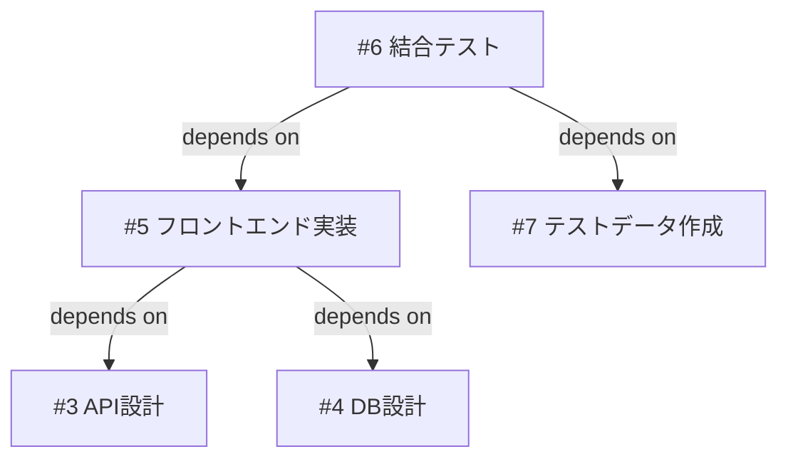
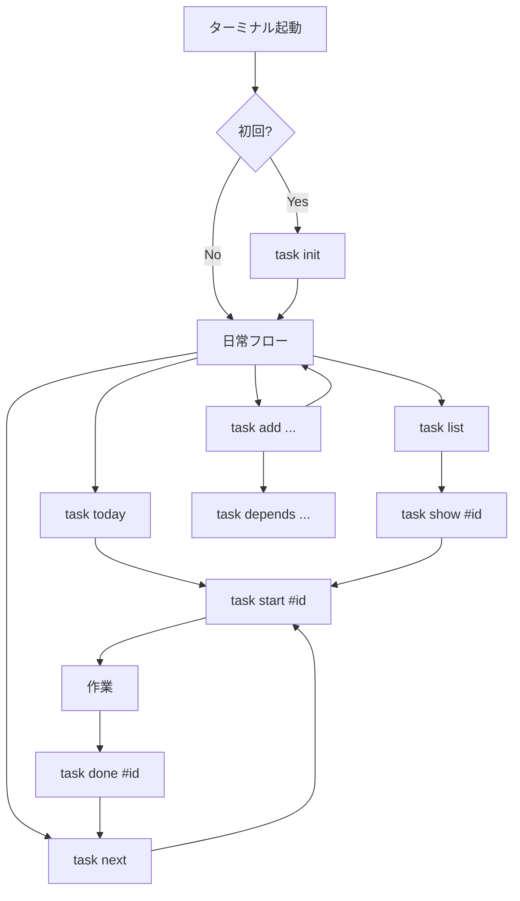

# 機能設計書

## 1. システム構成

### 全体アーキテクチャ

本プロダクトはスタンドアロンのCLIアプリケーションであり、ネットワーク通信を行わない。

```
┌─────────────────────────────────────────────────┐
│                    CLI Layer                     │
│  (コマンドパーサー / 引数バリデーション / 出力)    │
└─────────────┬───────────────────────────────────┘
              │
              ▼
┌─────────────────────────────────────────────────┐
│                  Domain Layer                    │
│  (タスク操作 / スコアリング / 依存関係管理)       │
└─────────┬───────────────────────┬───────────────┘
          │                       │
          ▼                       ▼
┌─────────────────────┐  ┌───────────────────────────┐
│   Storage Layer     │  │   Config Layer             │
│  (Markdown読み書き /│  │  (設定ファイル読み込み /    │
│   ロックファイル /  │  │   デフォルト値管理)         │
│   ID採番)           │  │                             │
└─────────┬───────────┘  └───────────┬─────────────────┘
          │                          │
          ▼                          ▼
┌─────────────────────┐  ┌───────────────────────────┐
│   ~/.local/share/   │  │   ~/.config/taskctl/       │
│   taskctl/          │  │   config.toml              │
│   *.md (タスク)     │  │                             │
│   .lock             │  │                             │
│   .meta.json        │  │                             │
└─────────────────────┘  └───────────────────────────┘
```

### レイヤー間の責務と依存関係

| レイヤー | 責務 | 依存先 |
|---|---|---|
| CLI Layer | コマンドライン引数の解析、入力バリデーション、出力フォーマット（カラー/JSON/プレーン） | Domain Layer |
| Domain Layer | タスクのビジネスロジック（CRUD、ステータス遷移、スコアリング、依存関係管理） | Storage Layer, Config Layer |
| Storage Layer | Markdownファイルの読み書き、ロックファイル管理、ID採番、スキーマバージョン管理 | ファイルシステム |
| Config Layer | TOML設定ファイルの読み込み、デフォルト値の提供 | ファイルシステム |

Domain LayerはConfig Layerからスコアリングの重みパラメータや見積もり換算値を取得する。

## 2. データモデル

### 2.1 タスク

```yaml
---
id: 12
title: "認証APIのエラーハンドリング"
status: "pending"           # pending | in_progress | done
created_at: "2025-02-01T10:00:00+09:00"
updated_at: "2025-02-03T15:30:00+09:00"
due: "2025-02-10"
tags:
  - backend
  - auth
estimate: "2h"
depends_on:
  - 8
  - 11
pinned: false
pinned_at: null
schema_version: 1
---

## メモ

API仕様を確認してから着手する。
エラーレスポンスの形式はRFC 7807に準拠する。
```

### 2.2 タスク属性の定義

| 属性 | 型 | 必須 | デフォルト | 説明 |
|---|---|---|---|---|
| `id` | integer | はい | 自動採番 | タスクの一意識別子。1から始まる連番 |
| `title` | string | はい | — | タスクのタイトル |
| `status` | enum | はい | `pending` | `pending` / `in_progress` / `done` |
| `created_at` | datetime (ISO 8601) | はい | 作成時の現在時刻 | タスクの作成日時 |
| `updated_at` | datetime (ISO 8601) | はい | 作成時の現在時刻 | タスクの最終更新日時 |
| `due` | date (`YYYY-MM-DD`) | いいえ | `null` | 期限日 |
| `tags` | string[] | いいえ | `[]` | タグのリスト |
| `estimate` | string | いいえ | `null` | 見積もり（`30m`, `2h`, `3p`） |
| `depends_on` | integer[] | いいえ | `[]` | 依存先タスクIDのリスト |
| `pinned` | boolean | はい | `false` | 手動優先度固定フラグ |
| `pinned_at` | datetime (ISO 8601) | いいえ | `null` | pin実行日時（pinned時のソート用） |
| `schema_version` | integer | はい | `1` | データスキーマのバージョン |

### 2.3 メタデータファイル

ID採番の管理用に `.meta.json` をデータディレクトリに配置する。

```json
{
  "next_id": 13
}
```

- `next_id`: 次に作成するタスクに割り当てるID
- スキーマバージョンは各タスクファイルのFront Matterのみで管理する（`.meta.json` には持たない）

### 2.4 ファイル構成

1タスク1ファイル方式を採用する。

```
~/.local/share/taskctl/
├── .lock              # ロックファイル（書き込み時のみ存在）
├── .meta.json         # メタデータ（ID採番）
├── 1.md               # タスク#1
├── 2.md               # タスク#2
├── 3.md               # タスク#3
├── ...
└── 12.md              # タスク#12
```

**ファイル名規則:** `{id}.md`（例: `1.md`, `12.md`, `1000.md`）。ゼロ埋めは行わない。ソート順はIDの数値で判定し、ファイル名の文字列順には依存しない。

**データディレクトリの初期化:**
- 初回の書き込みコマンド（`task add` 等）実行時にデータディレクトリが存在しない場合、自動的に作成する
- `.meta.json` も同時に `{"next_id": 1}` で初期化する
- `task init` は設定ファイルのみを生成する（データディレクトリは対象外）

**1タスク1ファイルを採用する理由:**
- Gitでの差分が読みやすい（タスク単位の変更が明確）
- 同時アクセス時のロック粒度を小さくできる（将来的に）
- 個別タスクの読み書きが高速
- ファイルを直接開いて編集可能

### 2.5 ER図



タグは独立したエンティティではなく、タスクの属性（文字列配列）として保持する。依存関係は多対多（1つのタスクが複数に依存し、1つのタスクが複数から依存される）。

## 3. コマンド設計

### 3.1 コマンド一覧

| コマンド | 説明 | 書き込み |
|---|---|---|
| `task add <title> [options]` | タスク作成 | はい |
| `task show <id>` | タスク詳細表示 | いいえ |
| `task list [options]` | タスク一覧表示 | いいえ |
| `task edit <id> [options]` | タスク編集 | はい |
| `task delete <id>` | タスク削除 | はい |
| `task search <query>` | タスク検索 | いいえ |
| `task start <id>` | ステータスを `in_progress` に変更 | はい |
| `task done <id>` | ステータスを `done` に変更 | はい |
| `task pending <id>` | ステータスを `pending` に変更 | はい |
| `task pin <id>` | 優先度を固定 | はい |
| `task unpin <id>` | 優先度固定を解除 | はい |
| `task depends <id> --on <id>` | 依存関係を追加 | はい |
| `task undepends <id> --on <id>` | 依存関係を解除 | はい |
| `task tree <id>` | 依存関係ツリー表示 | いいえ |
| `task next` | 次にやるべきタスクを表示 | いいえ |
| `task today` | 今日のタスク一覧 | いいえ |
| `task init` | 設定ファイル生成 | はい（設定ファイル） |
| `task migrate` | データマイグレーション実行 | はい |
| `task completions <shell>` | シェル補完スクリプト出力 | いいえ |

### 3.2 グローバルオプション

| オプション | 説明 |
|---|---|
| `--json` | JSON形式で出力 |
| `--no-color` | カラーなしで出力 |
| `--data-dir <path>` | データディレクトリを一時的に変更 |
| `--config <path>` | 設定ファイルパスを一時的に変更 |
| `--version` | バージョン表示 |
| `--help` | ヘルプ表示 |

### 3.3 環境変数

| 環境変数 | 説明 | 対応するグローバルオプション |
|---|---|---|
| `TASKCTL_CONFIG` | 設定ファイルパス | `--config` |
| `TASKCTL_DATA_DIR` | データディレクトリパス | `--data-dir` |

優先順位: コマンドラインオプション > 環境変数 > 設定ファイル > デフォルト値

### 3.4 書き込み操作の成功メッセージ

書き込みコマンドが成功した場合、以下の形式でメッセージを表示する。

| コマンド | メッセージ例 |
|---|---|
| `task add` | `Created task #13: 認証APIのエラーハンドリング` |
| `task edit` | `Updated task #13` |
| `task delete` | `Deleted task #13` |
| `task start` | `Started task #13` |
| `task done` | `Completed task #13` |
| `task pending` | `Reopened task #13` |
| `task pin` | `Pinned task #13` |
| `task unpin` | `Unpinned task #13` |
| `task depends` | `Added dependency: #5 depends on #3` |
| `task undepends` | `Removed dependency: #5 no longer depends on #3` |

`task done` の副作用でブロックが解除された場合は追加で表示する:
```
Completed task #12
  Unblocked: #15, #18, #23
```

### 3.5 `task next` の詳細設計

```bash
task next
```

- `pending` および `in_progress` タスクの中から、スコアが最も高い1件を表示する
- pinnedタスクがある場合はpinnedタスクが優先される
- ブロックされているタスクは除外する（着手不可能なタスクを提示しない）
- 表示形式は `task show` の簡易版（タイトル + 主要なスコアリング要因を1行で表示）

```
$ task next
→ #12 認証APIのエラーハンドリング
   due: 明日 | blocks: 3件 | 見積もり: 1h
```

- 該当タスクがない場合（全タスクが `done` またはブロック中）:
```
$ task next
No actionable tasks found.
```

### 3.6 `task today` の詳細設計

```bash
task today
```

- 以下の条件のいずれかに合致するタスクをスコア順で表示する:
  - 期限が今日以前のタスク（`due <= today`、ステータスが `done` 以外）
  - ステータスが `in_progress` のタスク
  - pinnedタスク（ステータスが `done` 以外）
- ブロックされているタスクも条件に合致すれば表示する（`[blocked]` マーク付き）
- 該当タスクがない場合は `task next` と同じ結果（最も優先度の高い1件）を表示する

### 3.7 `task search` の詳細設計

```bash
task search <query> [options]
```

- タスクのタイトルとメモに対する部分一致検索を行う
- 大文字小文字を区別しない（case-insensitive）
- 完了タスクも検索対象に含める
- `--tag`, `--status` フィルタと組み合わせ可能
- 検索結果は `task list` と同じ形式で表示する

### 3.8 `task migrate` の詳細設計

```bash
task migrate
```

- データディレクトリ内の全タスクファイルのスキーマバージョンを確認する
- 現行バージョンより古いタスクファイルを検出し、新しいスキーマに変換する
- 変換前にバックアップディレクトリ（`data_directory/.backup-YYYYMMDD-HHMMSS/`）を作成する
- `--dry-run` オプションで変換対象の一覧のみを表示し、実際の変換は行わない

### 3.9 `task completions` の詳細設計

```bash
task completions <shell>
```

- 対応シェル: `bash`, `zsh`, `fish`
- Rustの `clap` クレートの補完生成機能を利用する
- 出力は標準出力に補完スクリプトを書き出す。ユーザーがシェル設定ファイルにリダイレクトして使用する

```bash
# 使用例
task completions zsh > ~/.zfunc/_task
task completions bash > ~/.local/share/bash-completion/completions/task
```

## 4. ステータス遷移



### 遷移ルール

| 遷移 | コマンド | 副作用 |
|---|---|---|
| → `pending` | `task add` | ID採番、ファイル作成、`updated_at` 設定 |
| `pending` → `in_progress` | `task start` | `updated_at` 更新 |
| `pending` → `done` | `task done` | `updated_at` 更新、依存タスクのブロック解除 |
| `in_progress` → `done` | `task done` | `updated_at` 更新、依存タスクのブロック解除 |
| `in_progress` → `pending` | `task pending` | `updated_at` 更新 |
| `done` → `pending` | `task pending` | `updated_at` 更新、依存タスクの再ブロック |

### `done` → `pending` 時の依存関係再評価

タスクを完了から未着手に戻した場合、そのタスクに依存していたタスク群が再びブロック状態になる。

### 冪等性

同じステータスへの遷移（例: `done` のタスクに `task done`）は冪等に処理する。エラーにはせず、何も変更せずに成功メッセージを表示する。`updated_at` も更新しない。

## 5. スコアリングアルゴリズム

### 5.1 スコア算出式

```
score = w_urgency   * urgency_signal
      + w_blocking  * blocking_signal
      + w_staleness * staleness_signal
      + w_quick_win * quick_win_signal
      + blocked_penalty
```

各シグナルは0.0〜10.0の範囲に正規化される。重み（`w_*`）はシグナル値に対する乗数であり、設定ファイルの `[priority.weights]` で変更できる。

デフォルト重みでの理論的スコア範囲:
- 最大: `1.0*10 + 0.8*10 + 0.5*10 + 0.3*10 = 26.0`
- 最小（ブロック時）: `-1000.0`
- 最小（非ブロック時）: `0.0`

### 5.2 各シグナルの算出

#### urgency_signal（期限の接近）

```
due が未設定の場合: 0.0

due が設定済みの場合:
  days_remaining = due - today
  days_remaining <= 0 の場合: 10.0（期限超過）
  days_remaining >= 30 の場合: 0.0
  それ以外: 10.0 * (1 - days_remaining / 30)
```

#### blocking_signal（他タスクのブロック数）

このタスクが完了することでブロック解除されるタスクの数。直接の依存のみカウントし、間接的な依存は含まない。

```
blocks_count = このタスクを depends_on に含むタスクの数（ステータスが done 以外）

blocks_count = 0 の場合: 0.0
blocks_count >= 5 の場合: 10.0
それ以外: 10.0 * (blocks_count / 5)
```

#### staleness_signal（放置期間）

```
days_since_update = today - updated_at.date

days_since_update <= 0 の場合: 0.0
days_since_update >= 14 の場合: 10.0
それ以外: 10.0 * (days_since_update / 14)
```

#### quick_win_signal（タスク粒度）

```
estimate が未設定の場合: 0.0

estimate を時間に正規化した値を hours とする:
  hours <= 0.5 の場合: 10.0
  hours >= 8 の場合: 0.0
  それ以外: 10.0 * (1 - hours / 8)
```

#### blocked_penalty（ブロックペナルティ）

```
depends_on に未完了タスクが含まれる場合: -1000.0
それ以外: 0.0
```

### 5.3 ソートルール

1. **pinnedタスク**が最上位（pinned同士は `pinned_at` の昇順）
2. **スコア降順**（高スコアが上位）
3. **スコアが同一の場合**: `created_at` の昇順（古いタスクを優先）

### 5.4 簡易説明の生成ルール

`task next` / `task today` / `task list` の各タスク行に表示する簡易説明は、以下の優先順で最大3項目を選択する。

| 条件 | 表示 |
|---|---|
| `due` が設定済み | `due: 明日` / `due: 2/10` / `due: 期限超過` |
| blocks_count > 0 | `blocks: N件` |
| `estimate` が設定済み | `見積もり: 2h` |
| `pinned == true` | `pinned` |
| `depends_on` に未完了あり | `blocked by: #3, #8` |

## 6. 依存関係管理

### 6.1 データ構造

依存関係は各タスクの `depends_on` フィールドに依存先のIDリストとして保持する。グラフの辺は「タスクA は タスクB に依存する」を表す。



### 6.2 循環依存の検出

依存関係の追加時（`task depends` および `task edit` での `depends_on` 変更時）に深さ優先探索（DFS）でサイクルを検出する。サイクルが検出された場合はエラーを返し、依存関係を追加しない。

自分自身への依存（`task depends 5 --on 5`）もサイクルとして検出し、エラーを返す。

```
task depends 3 --on 5
→ Error: 循環依存が発生します (#3 → #5 → #3)

task depends 5 --on 5
→ Error: タスクは自分自身に依存できません (#5)
```

### 6.3 `task tree` の出力例

```
$ task tree 6
#6 結合テスト [pending]
├── #5 フロントエンド実装 [in_progress]
│   ├── #3 API設計 [done] ✓
│   └── #4 DB設計 [done] ✓
└── #7 テストデータ作成 [pending]
```

### 6.4 依存先タスクの削除

依存先タスクが `task delete` で削除された場合、依存元タスクの `depends_on` から該当IDを自動的に除去する。

### 6.5 完了タスクへの依存関係操作

- `done` タスクに対する `task depends` は許可する（完了の巻き戻しに備えて依存関係を先に設定するケース）
- ブロック状態の判定は `depends_on` に含まれるタスクの現在のステータスで動的に行うため、依存先が `done` の場合はブロックされない

## 7. 設定ファイル

### 7.1 読み込み優先順位

1. コマンドライン引数 `--config <path>` / `--data-dir <path>`
2. 環境変数 `TASKCTL_CONFIG` / `TASKCTL_DATA_DIR`
3. 設定ファイル `~/.config/taskctl/config.toml`
4. デフォルト値（設定ファイルが存在しない場合）

### 7.2 デフォルト設定の全量

```toml
[priority.weights]
urgency = 1.0       # シグナル値(0-10)に対する乗数
blocking = 0.8
staleness = 0.5
quick_win = 0.3

[estimate]
point_to_hours = 1.0

[display]
color = true
date_format = "%Y-%m-%d"

[data]
directory = "~/.local/share/taskctl"
```

### 7.3 `task init` の挙動

- 設定ファイルが存在しない場合: デフォルト値で `~/.config/taskctl/config.toml` を生成
- 設定ファイルが既に存在する場合: エラーメッセージを表示（上書きしない）。`--force` で上書き可能

## 8. 出力フォーマット

### 8.1 `task list` のデフォルト出力例

デフォルトでは `pending` と `in_progress` のタスクのみ表示する。

```
  #  Status       Title                              Due        Est   Tags
  5  ● progress   フロントエンド実装                   2/15       4h    frontend
  7  ○ pending    テストデータ作成                     2/12       30m   test
  6  ○ pending    結合テスト [blocked]                 2/20       3h    test
```

- `●`: in_progress（緑表示）
- `○`: pending（白表示）
- `[blocked]`: 依存先が未完了（黄色表示）

`task list --all` または `task list --status=done` を指定した場合のみ完了タスクが表示される:
- `✓`: done（グレー表示）

タスクが0件の場合:
```
$ task list
No tasks found. Use 'task add' to create one.
```

### 8.2 `task list --json` の出力例

```json
[
  {
    "id": 7,
    "title": "テストデータ作成",
    "status": "pending",
    "created_at": "2025-02-01T10:00:00+09:00",
    "updated_at": "2025-02-01T10:00:00+09:00",
    "due": "2025-02-12",
    "tags": ["test"],
    "estimate": "30m",
    "depends_on": [],
    "pinned": false,
    "pinned_at": null,
    "score_info": {
      "sort_position": 1,
      "primary_factors": ["due: 2/12", "見積もり: 30m"]
    }
  }
]
```

タスクが0件の場合は空配列 `[]` を返す。

### 8.3 `task show <id>` の出力例

```
Task #12
━━━━━━━━━━━━━━━━━━━━━━━━━━━━━━━━━━
Title:      認証APIのエラーハンドリング
Status:     ○ pending
Due:        2025-02-10 (あと6日)
Estimate:   2h
Tags:       backend, auth
Pinned:     No
Created:    2025-02-01 10:00
Updated:    2025-02-03 15:30

Dependencies:
  depends on: #8 DB接続プール設定 [done] ✓
              #11 認証ミドルウェア [in_progress]
  blocks:     #15 E2Eテスト
              #18 ドキュメント更新
              #23 リリース準備

Note:
  API仕様を確認してから着手する。
  エラーレスポンスの形式はRFC 7807に準拠する。
```

## 9. エラーハンドリング

### 9.1 エラーカテゴリ

| カテゴリ | 終了コード | 例 |
|---|---|---|
| 入力エラー | 1 | 不正な引数、存在しないタスクID |
| データエラー | 2 | Markdownパース失敗、スキーマバージョン不一致 |
| ロックエラー | 3 | ロック取得失敗（他プロセスが書き込み中） |
| 設定エラー | 4 | TOMLパース失敗、不正な設定値 |

### 9.2 エラーメッセージの形式

```
Error: タスク #99 は存在しません
```

```
Error: 循環依存が発生します (#3 → #5 → #3)
```

```
Error: ロックファイルの取得に失敗しました。他のプロセスが書き込み中の可能性があります。
Hint: 問題が解決しない場合は ~/.local/share/taskctl/.lock を手動で削除してください。
```

- `Error:` プレフィックスで統一
- 可能な場合は `Hint:` で解決策を提示

### 9.3 ロックファイルの挙動

- 書き込みコマンド実行時にロックファイルを作成する
- ロックはアドバイザリロック（`flock`相当）を使用する
- ロック取得のタイムアウト: 5秒
- プロセスが異常終了した場合のステールロック対策: ロックファイルにPIDを記録し、該当プロセスが存在しない場合はロックを無視する

## 10. エッジケースの定義

| ケース | 挙動 |
|---|---|
| 既に `done` のタスクに `task done` | 冪等に処理。変更なし、成功メッセージを表示 |
| 既に `in_progress` のタスクに `task start` | 冪等に処理。変更なし、成功メッセージを表示 |
| 既に `pinned` のタスクに `task pin` | 冪等に処理。`pinned_at` は更新しない |
| 既に `unpinned` のタスクに `task unpin` | 冪等に処理。変更なし |
| 自分自身への依存 `task depends 5 --on 5` | エラー: `タスクは自分自身に依存できません` |
| 既に存在する依存関係を再追加 | 冪等に処理。変更なし |
| `done` タスクへの `task edit` | 許可する。属性の変更は可能 |
| `done` タスクへの `task depends` | 許可する（6.5節参照） |
| `task edit` での `depends_on` 変更 | 循環依存チェックを実行する（6.2節参照） |
| タスクが0件時の `task list` | `No tasks found. Use 'task add' to create one.` |
| タスクが0件時の `task next` | `No actionable tasks found.` |
| タスクが0件時の `task today` | `task next` と同じ結果にフォールバック |
| ユーザーがMarkdownファイルを直接編集して不正な値を設定 | パース可能な範囲で読み込み、不正なフィールドは警告を表示してデフォルト値で補完 |

## 11. 画面遷移

CLIアプリケーションのため画面遷移はないが、コマンドの使用フローを示す。


